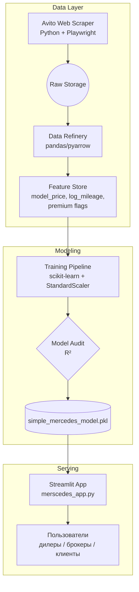

<div align="center">
    
</div>
<div align="center">

# Mercedes-Benz Price Intelligence

**Ценовая разведка премиум-класса: от “сырых” объявлений Avito до умного Streamlit-приложения.**

[](https://merscedes.streamlit.app/)


<sub>Данные собраны моим веб-скрапером с Avito, предобработаны, обогащены и превращены в реальный продукт с метрикой MAPE ≈ 6.8 %.</sub>

</div>

---

## 💎 Зачем я это сделал?
- **Заказчики и дилеры** получают честный ориентир по стоимости Mercedes-Benz на российском рынке, не полагаясь на шумные объявления.  
- **Аналитики** видят живую модель с прозрачными признаками и метриками.  
- **Покупатели** могут быстро проверить, совпадает ли цена конкретного авто с рыночной.

---

## 🏎️ Откуда данные
> **Источник** — мои реальные выгрузки Avito (скрипт на Python + Playwright).  
> **Что беру** — модель, год, пробег, цену, тип продавца, регион, дополнительные описания.  
> **Почему это важно** — никакой синтетики, только “боевые” наблюдения → модель понимает рынок так же, как и живой продавец.

Каждый запуск собирает свежие объявления, складывает их в «сырой» слой, а дальше вступает в работу чистка:
1. Дедуп (по VIN/описанию).  
2. Нормализация валюты и форматирований.  
3. Инженерия признаков (возраст, логарифм пробега, премиальность).  
4. Привязка к встроенному справочнику `model_prices`, чтобы модель понимала, чем CLA отличается от S-класса.

---

## 🧠 Архитектура уровня production



**Почему это круто:**
- Артефакт не просто веса модели — внутри лежат `model`, `scaler`, `features`, `model_prices`. Это гарантия, что прод и трен одинаковы до байта.  
- Между слоями чёткие контракты: сырые данные → фичи → прод. Можно переобучить модель, не трогая UI.  
- Архитектура легко переносится в облако: хранение на S3, пайплайн в Airflow, Streamlit в ECS/Cloud Run.

---

## 🧬 Как работает модель
- **Таргет** – логарифм цены (`log1p`), чтобы стабилизировать распределение и научить модель равномерно уважать и свежие GLE, и старые E-классы.  
- **Признаки** – возраст, `log_mileage`, флаги «новый/с пробегом», «премиум», «большой пробег», а также **динамический baseline** `model_price` (медиана по каждой модели, рассчитанная на свежих данных).  
- **Метрики** – R² = 0.8732, средняя ошибка 6.8 %, медианная 4.4 % (валидировалось стратифицированным 5-fold).  
- **Времена отклика** – <5 мс на CPU: один вызов `StandardScaler` + регрессионная модель.  
- **Надёжность** – если пользователь выбрал редкую модель, система fallback’ается к среднему baseline по всему автопарку, не ломаясь.

---

## 🔥 UX Streamlit-приложения

**Что увидит пользователь:**
- Выбор модели из каталога, год (1990–2025), пробег (0–500 000 км).  
- Мгновенный расчёт возраста и статуса «Новый / С пробегом».  
- Красивый блок `st.metric` с ценой в ₽ и подсветкой пробега.  
- Кнопка «Примеры», моментально показывающая сценарии CLA / GLE / S-класс.  
- Раздел «ℹ️ О модели» с метриками — доверие строится на прозрачности.  
- Бдительные обработчики ошибок: если артефакт не найден или данные некорректны, UI не “падает”, а сообщает, что делать.

---

## 💼 Польза для бизнеса
- **Дилеры**: понимают, по какой цене действительно продаются Mercedes в Москве, СПб и регионах — и могут выстраивать политику trade-in.  
- **Маркетплейсы**: интегрируют модель в форму публикации объявления, чтобы подсказать продавцу «рыночную» цену и уменьшить пустые просмотры.  

---

## 🧠 Технологии
| Уровень | Инструменты | Зачем |
| --- | --- | --- |
| Сбор данных | Python, Playwright/Selenium | Быстрый, гибкий веб-скрапер Avito |
| Подготовка | pandas, numpy, pyarrow | Чистка, фичи, логарифмы, агрегации |
| Моделирование | scikit-learn (`StandardScaler` + регрессор) | Лёгкий и объяснимый предсказатель |
| Сервис | Streamlit, pickle-артефакт | Мгновенный UX, повторяемость деплоев |

---

## 🚀 Быстрый старт (когда захотите потрогать код)
```bash
git clone <repo> mers && cd mers
python -m venv .venv && .venv\Scripts\activate
pip install -r requirements.txt
streamlit run merscedes_app.py
```
Файл `simple_mercedes_model.pkl` уже в репозитории — можно запускать мгновенно.  
Прод-версия живёт в Streamlit Cloud: [merscedes.streamlit.app](https://merscedes.streamlit.app/).

---

## ✅ FAQ
- **Можно ли использовать для других брендов?** Да, просто пересоберите скрапер и переобучите пайплайн — архитектура уже готова.  
- **Почему выбрал Streamlit?** Хотел максимально быстро показать результат. Когда нужно будет “железобетонное” API — тот же код легко завернуть в FastAPI.

---

<div align="center">
    Сделано с вниманием к деталям Mercedes, к российскому рынку и к тому, как выглядит настоящая data-driven экспертиза.
</div>


